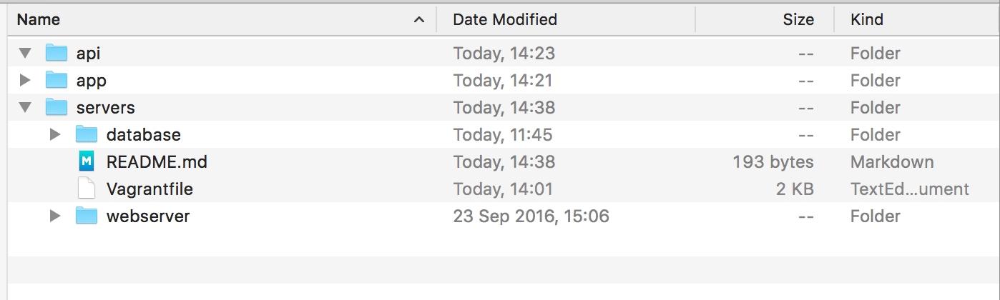

# Local Vagrant Provisioning Script

Hello dev friends, this is how you locally set up a vagrant dev environment that is identical to our production environment.
First set up a file structure like so:

Then clone down this repository into the 'servers' folder with the command ```
git clone https://github.com/Prendy/WhatTheDevOps.git . ``` 
Surprisingly, the 'api' and 'app' folders will contain your API and app stuff. 
After cloning, open the terminal and point it at the 'servers' folder. Then type ```vagrant up``` and a lot of things should hopefully start happening and things should work. This will take a while.

Vagrant is set up such that the overall app is split into three virtual machines: app, api, and db. If you have any of your app code pointing at a database, make sure you use the local ip of the database: ```192.10.10.200```. Previously I think you would have used localhost. The 'app' machine will automatically pull the files from the app folder and the 'api' machine will pull the files from the api folder. 

If you need to access the VMs, type ```vagrant ssh app``` for the app VM, ```vagrant ssh api``` for the api VM, and ```vagrant ssh db``` for the database VM.

## Starting the app

1. First, access the app vm by typing ```vagrant ssh app``` in the terminal. 
2. ```cd /var/www/html```
3. ```npm install```
4. ```node app.js```
5. The app should run!